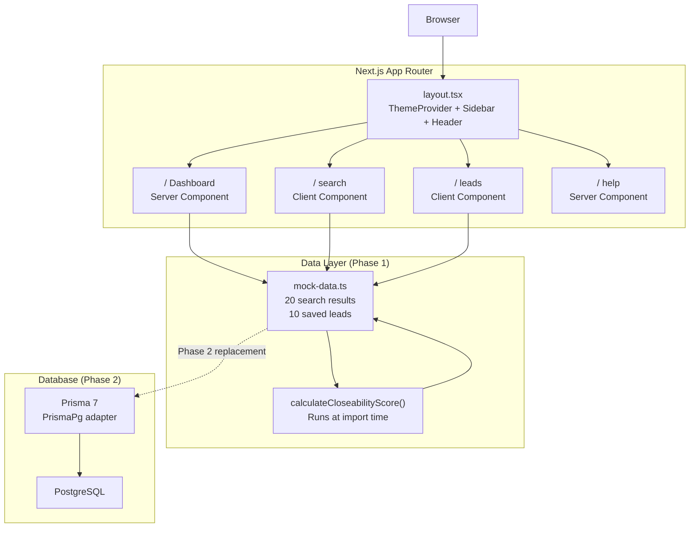
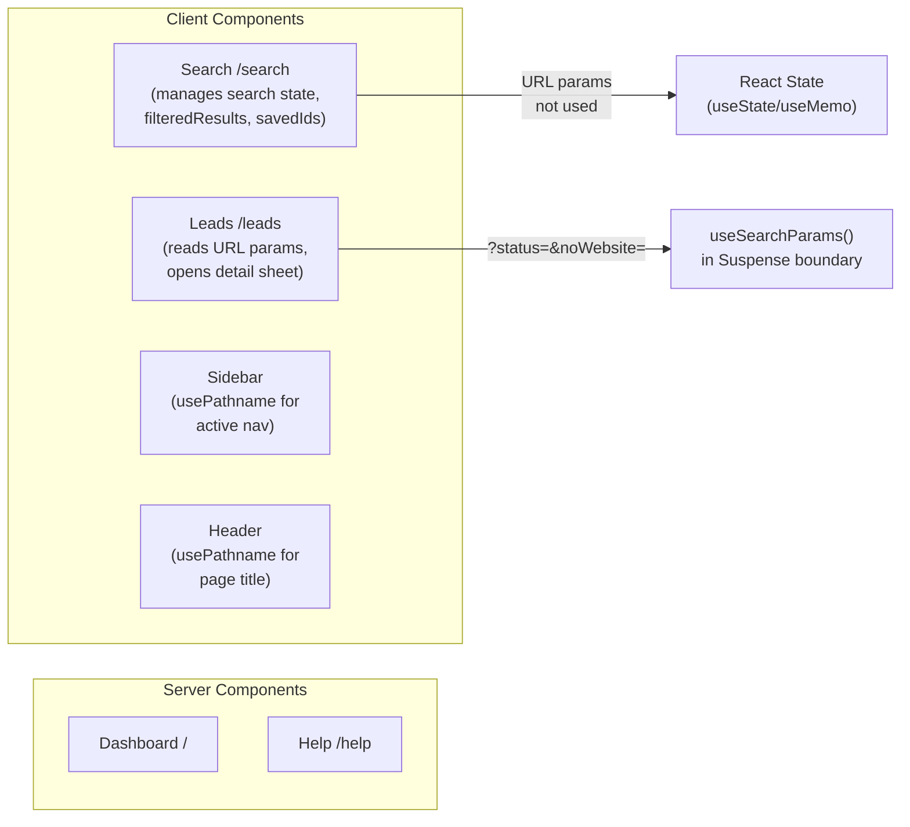

# Sweet Tea CRM — Architecture

## Stack

| Layer | Technology |
|---|---|
| Framework | Next.js 16.2.4 (App Router, Turbopack) |
| Language | TypeScript 5 |
| Styling | Tailwind CSS v4 (CSS variables, oklch color space) |
| Components | shadcn/ui (built on `@base-ui/react`) |
| Database | PostgreSQL via Prisma 7 (adapter pattern) |
| ORM | Prisma 7 with `PrismaPg` driver adapter |
| Theming | next-themes (`attribute="class"`) |
| Testing | Vitest 4 |

---

## Folder Structure

```
src/
├── app/                        # Next.js App Router routes
│   ├── page.tsx                # Dashboard (server component)
│   ├── search/page.tsx         # Lead search (client component)
│   ├── leads/page.tsx          # Lead management (client component)
│   ├── help/page.tsx           # User documentation
│   └── globals.css             # Tailwind base + TE theme variables
│
├── components/
│   ├── layout/                 # Sidebar, Header, ThemeToggle
│   ├── dashboard/              # StatsCards, TopLeads, RecentActivity, LeadsByStatus
│   ├── search/                 # SearchForm, SearchFilters, LeadCard, LeadGrid
│   ├── leads/                  # LeadManageCard, LeadDetailSheet, LeadStatusBadge, QuickActions, LeadFilters
│   ├── shared/                 # ScoreBadge, ScoreBar (reused across search + leads)
│   └── ui/                     # shadcn primitives (Card, Button, Badge, Sheet, etc.)
│
├── lib/
│   ├── mock-data.ts            # Phase 1 mock data (uses real scoring algorithm)
│   ├── db.ts                   # Prisma client stub (Phase 2: PrismaPg adapter)
│   ├── utils.ts                # cn() tailwind merge helper
│   └── scoring/
│       ├── types.ts            # LeadScoringInput, CloseabilityScoreResult interfaces
│       ├── calculateCloseabilityScore.ts  # Main scorer
│       ├── mockLeads.ts        # 5 representative pre-scored leads
│       └── modules/
│           ├── websiteScore.ts
│           ├── digitalPresenceScore.ts
│           ├── activityScore.ts
│           ├── industryFitScore.ts
│           ├── revenueProxyScore.ts
│           ├── reachabilityScore.ts
│           ├── competitionPressureScore.ts
│           └── penaltyScore.ts
│
├── types/
│   └── index.ts                # Lead, SearchResult, ScoreBreakdown, LeadStatus, etc.
│
└── generated/
    └── prisma/client/          # Prisma-generated client (gitignored)
```

---

## Application Architecture



---

## Page Rendering Strategy



**Why this split:** The dashboard has no user interaction and benefits from SSR. Search results are client-managed state (simulating an API call). Leads uses URL params so filters are deep-linkable and shareable.

---

## Theme System

Tailwind v4 uses CSS custom properties declared in `:root` and `.dark`. Colors are in oklch for perceptual uniformity.

```css
/* globals.css — simplified */
:root {
  --primary: oklch(0.63 0.22 36);   /* TE orange ~#FF5500 */
  --background: oklch(1 0 0);        /* white */
  --foreground: oklch(0.09 0 0);     /* near-black */
  --radius: 0.25rem;                  /* sharp corners everywhere */
}
.dark {
  --background: oklch(0.08 0 0);    /* near-black */
  --foreground: oklch(0.96 0 0);    /* near-white */
  --primary: oklch(0.63 0.22 36);   /* same orange — unchanged */
}
```

`next-themes` injects `class="dark"` on `<html>`. All components read `var(--primary)` etc via Tailwind utilities (`bg-primary`, `text-foreground`).

---

## shadcn/ui Notes

This project uses `@base-ui/react` (not Radix UI). The key difference:

- `Button` does **not** support `asChild`. Use `buttonVariants()` to get the class string and apply it directly to a native element:

```tsx
import { buttonVariants } from "@/components/ui/button"

// correct
<a href="tel:..." className={buttonVariants({ variant: "outline", size: "sm" })}>
  Call
</a>

// wrong — asChild does not exist
<Button asChild><a href="tel:...">Call</a></Button>
```

---

## Prisma 7 Notes

Prisma 7 requires a driver adapter — the old `new PrismaClient()` constructor is gone.

```ts
// Phase 2 db.ts implementation
import { PrismaPg } from "@prisma/adapter-pg"
import { PrismaClient } from "@/generated/prisma/client"
import pg from "pg"

const pool = new pg.Pool({ connectionString: process.env.DATABASE_URL })
const adapter = new PrismaPg(pool)
export const db = new PrismaClient({ adapter })
```

During Phase 1, `db.ts` exports a typed `null` stub so the type system works without a live database.

---

## Environment Variables

```bash
DATABASE_URL="postgresql://..."           # PostgreSQL connection string
GOOGLE_PLACES_API_KEY="AIza..."          # Google Places API (Phase 2+)
```

---

## Build & Test

```bash
npm run dev          # Start dev server (Turbopack)
npm run build        # Production build
npm test             # Vitest unit tests (run once)
npm run test:watch   # Vitest in watch mode
```
