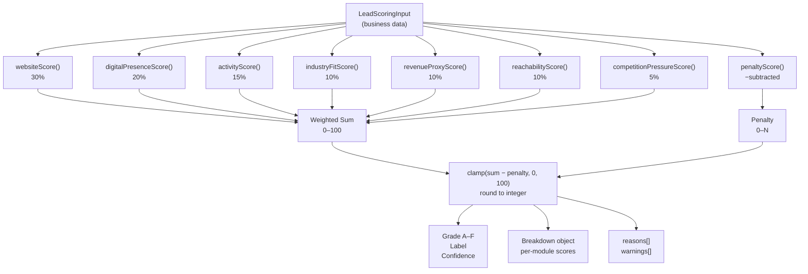
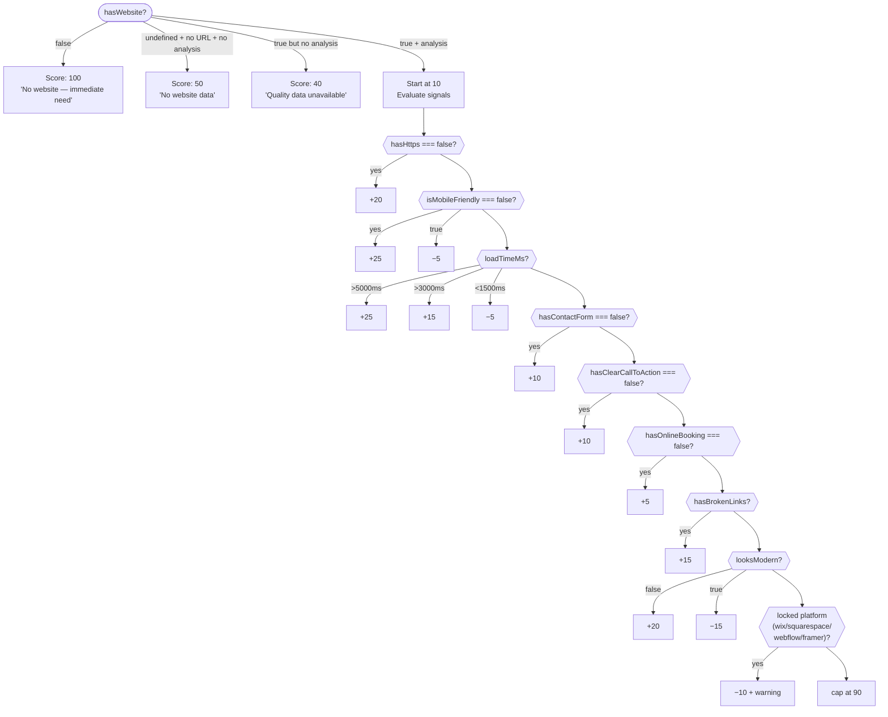
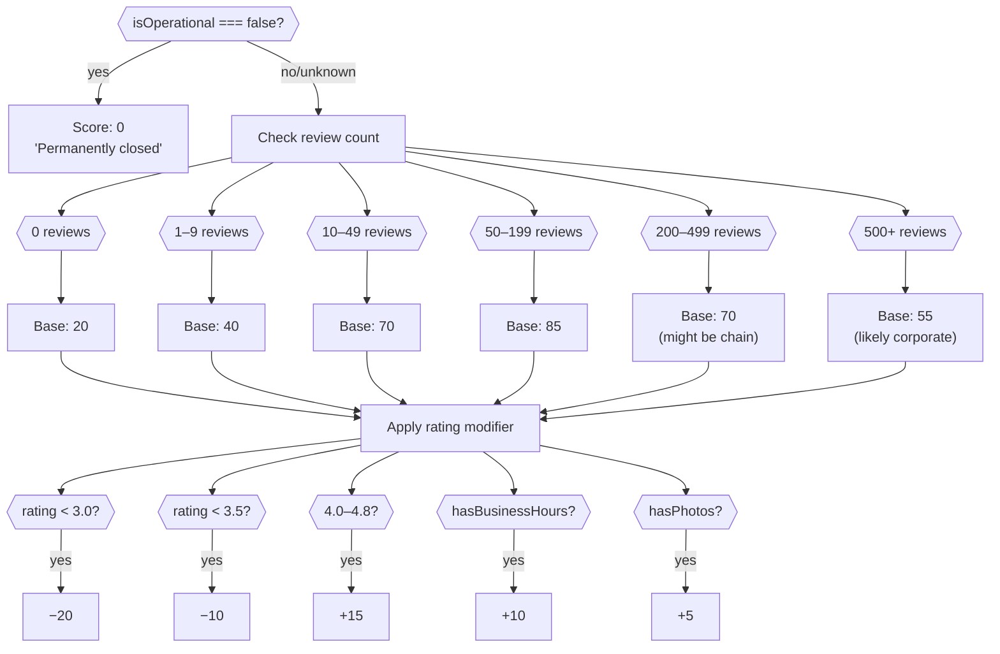
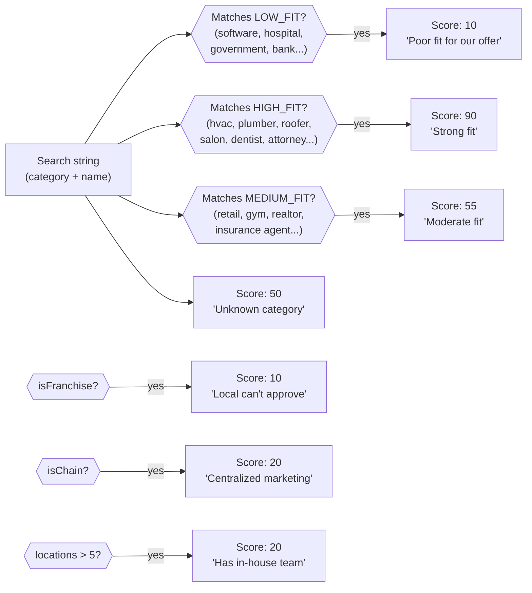
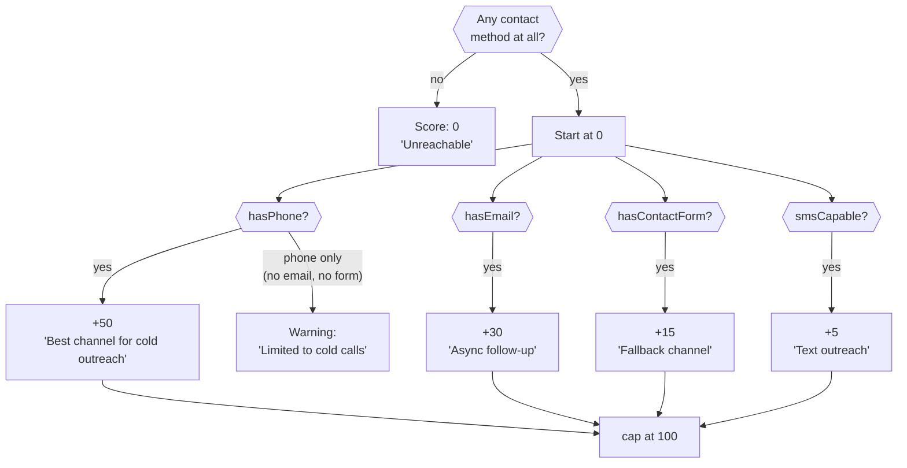
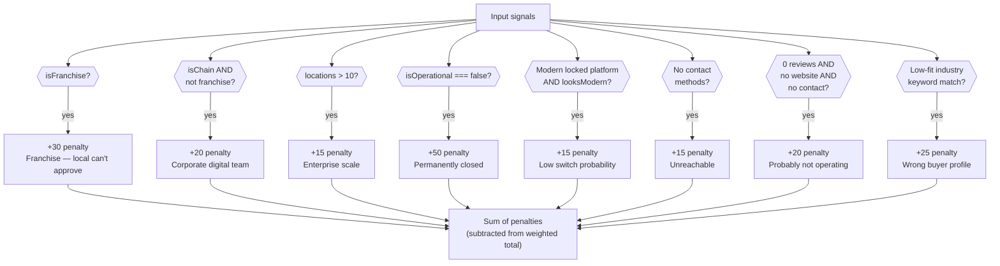
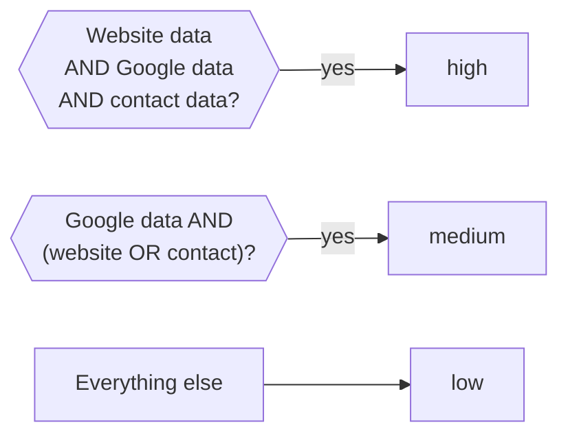

# Closeability Scoring Algorithm

The scoring system answers a single question: **how likely is a local business to need and buy a website from us?**

Every lead gets a score from 0–100 and a letter grade (A–F). The score is computed from seven weighted modules, with a penalty system that can subtract for hard disqualifiers.

---

## Grade Thresholds

| Grade | Range | Label |
|---|---|---|
| A | 80–100 | Hot lead |
| B | 65–79 | Strong lead |
| C | 45–64 | Possible lead |
| D | 25–44 | Weak lead |
| F | 0–24 | Poor fit |

---

## Score Formula

```
totalScore = clamp(weightedSum − penalties, 0, 100)

weightedSum =
  websiteScore        × 0.30
  digitalPresence     × 0.20
  activityScore       × 0.15
  industryFitScore    × 0.10
  revenueProxyScore   × 0.10
  reachabilityScore   × 0.10
  competitionPressure × 0.05
```

---

## System Overview



---

## Module Details

### 1. Website Score (30%)

> Higher score = more pain = more likely to buy.



**Key insight:** A business with a site (even a terrible one) is capped at 90 because they believe they're "covered." No website is the maximum pain signal (100).

---

### 2. Digital Presence Score (20%)

> Missing from the internet in ways the business owner probably doesn't realize.

Starts at 0. Pain signals add points; more pain = higher score.

| Signal | Points |
|---|---|
| No Facebook | +25 |
| No Instagram | +15 |
| Last social post >90 days ago | +20 |
| Last social post >30 days ago | +10 |
| No Google photos | +15 |
| No business hours on Google | +10 |
| Fewer than 5 reviews | +10 |
| No social data at all | +20 (with warning) |

---

### 3. Activity Score (15%)

> Is this a living business with real customers?



**Why the curve:** 200–500 reviews suggests a restaurant or chain doing volume. 50–200 is the sweet spot for a thriving local service business.

---

### 4. Industry Fit Score (10%)

> Do businesses in this category regularly buy websites from agencies like ours?



---

### 5. Revenue Proxy Score (10%)

> Can this business afford $100–200/month?

Base: **40** (most operating local businesses can afford it).

| Signal | Effect |
|---|---|
| 100+ reviews | +30 |
| 30+ reviews | +20 |
| 10+ reviews | +10 |
| 0 reviews | −10 |
| Price level 3+ ($$$$) | +20 |
| Price level 2 ($$$) | +10 |
| Price level 1 ($$) | −5 |
| 2–5 locations | +10 |
| 6+ locations | −10 |

---

### 6. Reachability Score (10%)

> Can we actually contact this business?



**Data sources for hasPhone:** `contact.phone` OR `googlePlace.hasPhone` — either one counts.

---

### 7. Competition Pressure Score (5%)

> How much pain is the business already feeling from competitors?

Base: **40** (every local market has some competition).

| Signal | Points |
|---|---|
| 10+ nearby competitors | +30 |
| 5–9 nearby competitors | +20 |
| 2–4 nearby competitors | +10 |
| 3+ competitors with better websites | +30 |
| 1–2 competitors with better websites | +15 |
| 3+ competitors with more reviews | +20 |
| 1–2 competitors with more reviews | +10 |

Capped at 100.

---

### 8. Penalty Score (subtracted from weighted total)

> Hard disqualifiers that override positive signals.



---

## Confidence Level



**Low confidence** means the score is based on very limited signals. A low-confidence A is less reliable than a high-confidence B.

---

## Example Scores

| Business | Key Signals | Score | Grade |
|---|---|---|---|
| Peak Plumbing Co. | No website, phone, 87 reviews, 4.6★, HVAC/plumbing fit | ~85 | A |
| FreshCuts Barber (franchise) | Modern Squarespace site, 210 reviews — but franchise | ~20 | F |
| Lone Star HVAC | Outdated HTTP site, phone+email, 143 reviews, 8 competitors | ~78 | B |
| Metro Glass (no contacts) | Bad site, no phone, no email, no contact form | ~35 | D |
| Sunrise Yoga Studio | Category only, no other data | ~45 | C |

---

## TypeScript Interfaces

```typescript
// Input
interface LeadScoringInput {
  businessName?: string
  category?: string
  categories?: string[]
  hasWebsite?: boolean
  websiteUrl?: string
  websiteAnalysis?: {
    hasHttps?: boolean
    isMobileFriendly?: boolean
    loadTimeMs?: number
    hasContactForm?: boolean
    hasClearCallToAction?: boolean
    hasOnlineBooking?: boolean
    hasBrokenLinks?: boolean
    looksModern?: boolean
    detectedPlatform?: string
  }
  googlePlace?: {
    rating?: number
    reviewCount?: number
    hasPhone?: boolean
    hasBusinessHours?: boolean
    hasPhotos?: boolean
    isOperational?: boolean
  }
  contact?: {
    phone?: string
    email?: string
    contactPageUrl?: string
    smsCapable?: boolean
  }
  social?: {
    hasFacebook?: boolean
    hasInstagram?: boolean
    lastPostDate?: string
  }
  business?: {
    isFranchise?: boolean
    isChain?: boolean
    numberOfLocations?: number
    priceLevel?: number
  }
  competition?: {
    nearbyCompetitorCount?: number
    competitorsWithBetterWebsites?: number
    competitorsWithMoreReviews?: number
  }
}

// Output
interface CloseabilityScoreResult {
  totalScore: number                   // 0–100
  grade: "A" | "B" | "C" | "D" | "F"
  label: string                        // "Hot lead", "Strong lead", etc.
  confidence: "low" | "medium" | "high"
  breakdown: {
    website: number
    digitalPresence: number
    activity: number
    industryFit: number
    revenueProxy: number
    reachability: number
    competitionPressure: number
    penalties: number
  }
  reasons: string[]   // positive signals
  warnings: string[]  // negative signals + disqualifiers
}
```

---

## File Map

```
src/lib/scoring/
├── types.ts                          # LeadScoringInput, CloseabilityScoreResult
├── calculateCloseabilityScore.ts     # Orchestrator — weights, penalty, grade, confidence
├── mockLeads.ts                      # 5 pre-scored example leads
├── __tests__/
│   └── calculateCloseabilityScore.test.ts  # 5 vitest scenarios
└── modules/
    ├── websiteScore.ts
    ├── digitalPresenceScore.ts
    ├── activityScore.ts
    ├── industryFitScore.ts
    ├── revenueProxyScore.ts
    ├── reachabilityScore.ts
    ├── competitionPressureScore.ts
    └── penaltyScore.ts
```

Each module exports a single function `(input: LeadScoringInput): ScoreModuleResult` where `ScoreModuleResult = { score: number; reasons: string[]; warnings: string[] }`.
